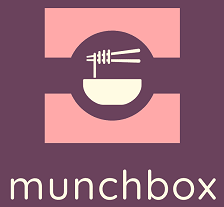
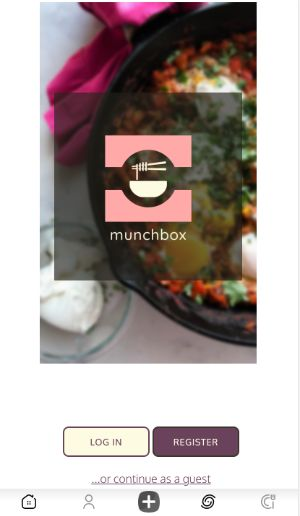
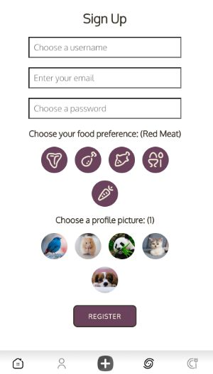
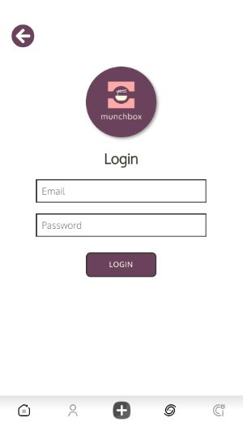

# MunchBox
MunchBox is an online platform for food lovers who want to exchange their ideas!
It is a sleek multiplatform recipe manager, accessible on your Apple iOS or Android devices,on your tablet, laptop or desktop.

# Brief Summary
Cooking can be a hobby, a dreaded necessity or just a
part of your routine, but no matter what your
relationship with the kitchen is like, cooking
takes time and effort. That’s where munchbox step in, offering step-by-step
instructions to help you prepare a hearty home-made
meal or curate a weekly meal plan that goes perfectly with your diet.

# Features
MunchBox is your very own personal recipe organiser.
1.  Add your favourite recipes from websites, magazines or recipe books  all in one place.
2.  Add the Food preference, allows individual users to save and view in their profile page.
3.  Save, update and delete recipes already created.
4.  Review and follow other users and their recipes.
5.  Randomly choose a Recipe you want to try by using a Spinner.
6.  Accessible on all of your devices, anytime.

## User Guide
To run the application locally, the user needs to clone the repository and install the support for NodeJS and Java.
This application was developed using Intellij IDE(using Spring Web Framework) and VisualStudio Code. It is recommended 
for the user to build the project using the gradle.build file, to ensure that all the dependencies are installed correctly.
The database for the project is run using PostgreSQL inside a docker compose file.

The project uses ReactJS as the front-end framework. In order to run the front-end application 
navigate into the front-end directory. 
The application was built using react modules and components.

## Prerequisites

1.  docker and docker-compose.
2. nodejs.

## Starting the database

In the root folder, run  docker-compose up

## Starting the backend server

Open the root folder and run ./gradlew bootRun

## Starting the frontend development server

The frontend application is in the directory frontend. From there, run
### `npm install`
to install all the dependencies needed for the project.

Then start the frontend application by running
### `npm start`

The "react-router-dom" was installed to allow routing between the pages using the command:
### `npm install react-router-dom`

Runs the app in the development mode.
Open [http://localhost:3000](http://localhost:3000) to view it in the browser.

The page will reload if you make edits.
You will also see any lint errors in the console.

## Usage
The web app is accessible on your Apple iOS or Android devices,
on your tablet, laptop or desktop.
## Main Page
* Click on Register button to navigate to register page  as a first time user of the App.
* Click on Login button to navigate to Login page if you are already a registered user.
* Click on guest link if you want to view the app recipes.

## Register Page
* Enter your name, email and password in the Sign Up box.
* Choose your food preference and profile picture.
* Click “Register” and you will be taken to the home page.

## Login Page
* As a registered user, just enter your email and password in the Login box to navigate to home page.

## Home Page
* This is the page where user can navigate to different pages in the app.
1. Profile page

# Class Diagram

# Authors

Created between Apr 22 - May 19 2021 as a final group project for Software Development Academy, iteration 9, by:

/- Fiona Thompson

/- Diana Bao

/- Radha Doreswamy

/- Rabunnisa Zabiulla

/- Sai Latha Tammana

# Credits

## Photo Credits

Welcome page photo "Cooking Shakshuka": Photo by <a href="https://unsplash.com/@foodwithaview?utm_source=unsplash&utm_medium=referral&utm_content=creditCopyText">Jenn Kosar</a> on <a href="https://unsplash.com/@foodwithaview?utm_source=unsplash&utm_medium=referral&utm_content=creditCopyText">Unsplash</a>

## Icon Credits

Navbar icons made by <a href="https://www.freepik.com" title="Freepik">Freepik</a> from <a href="https://www.flaticon.com/">Flaticon</a>

Filled plus symbol icon made by <a href="https://www.flaticon.com/authors/vectors-market">Vectors Market</a> from <a href="https://www.flaticon.com/">Flaticon</a> and recolored

Toggle icon made by <a href="https://www.flaticon.com/authors/pixel-perfect">Pixel perfect</a> from <a href="https://www.flaticon.com/">www.flaticon.com</a>

Following icon made by <a href="https://www.flaticon.com/authors/prosymbols">Prosymbols</a> from <a href="https://www.flaticon.com/" title="Flaticon">www.flaticon.com</a>

## Other Credits

Font 'Oxygen' from <a href="https://fonts.google.com/specimen/Oxygen">Google Fonts</a>

Logo styling by <a href="https://hatchful.shopify.com/">Hatchful</a>

Auth system adapted from SDA Mini Group Project skeleton <a href="https://github.com/softwaredevacademy/be-mini-group-project">on Github</a>

## Q&A and issue tracking

If you have any questions, feedback, or feature requests, don't hesitate to add an issue to the GitHub repo.